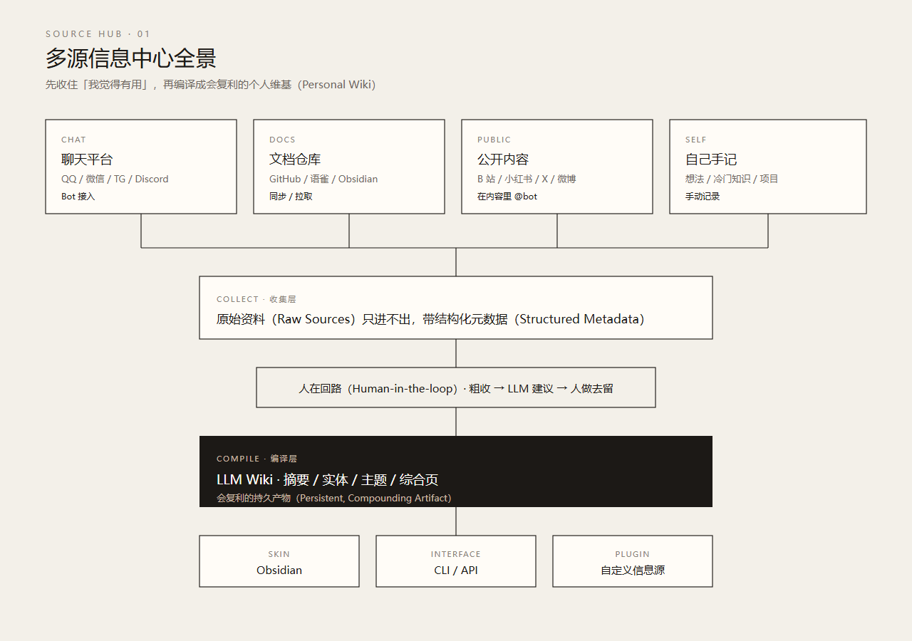
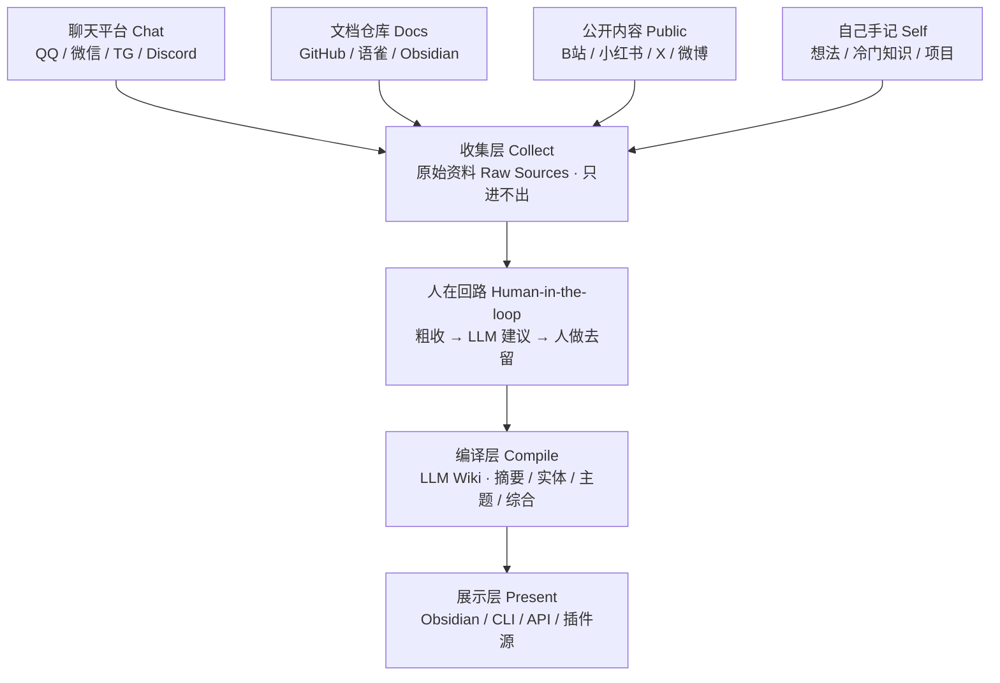
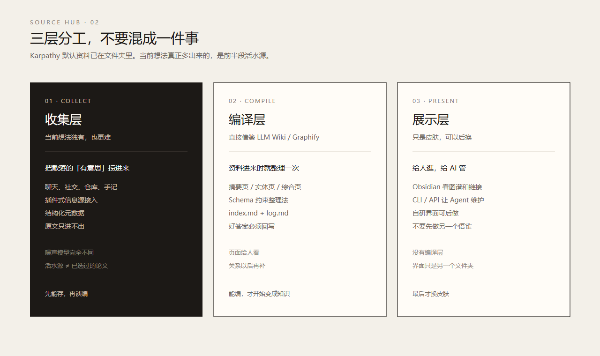
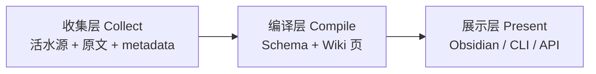
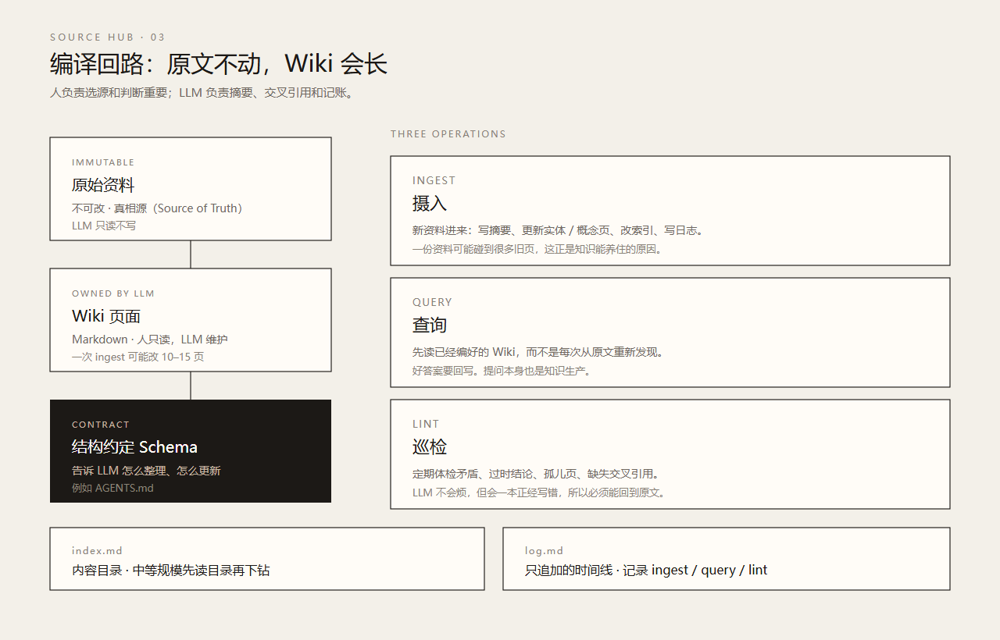
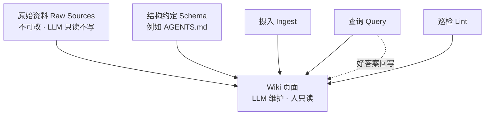
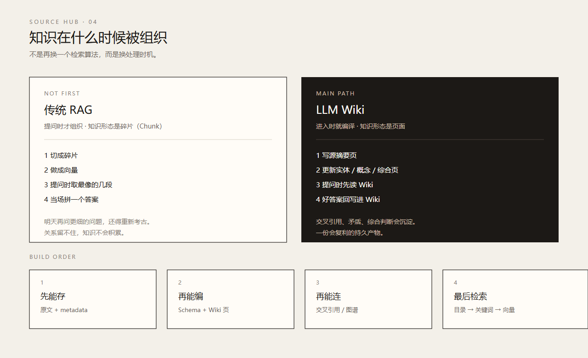
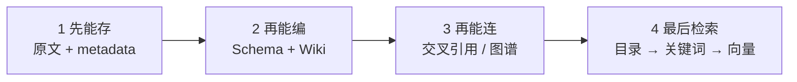
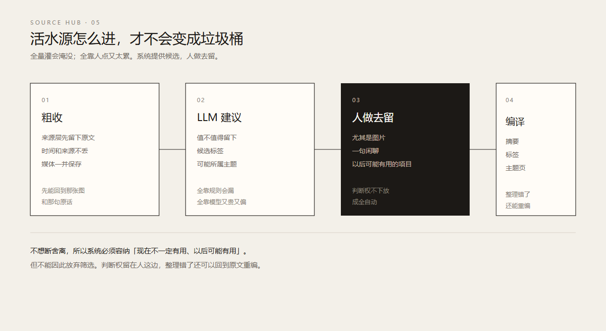
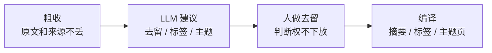

# Metadata（元数据）

- 创建时间（Created At）：2026-08-13 20:18:00 +08:00
- 更新时间（Updated At）：2026-09-09 15:37:05 +08:00（Codex 补充当前状态）
- 作者（Author）：Grok
- 目的（Purpose）：把《多源信息中心与 LLM Wiki 知识预编译讨论整理》收敛成几张简约结构图，方便后续 Align / PRD（Product Requirements Document，产品需求文档）对照。
- 关联仓库或项目（Related Repository / Project）：mine-interest-source-hub
- 关联 mission（Related Mission）：`.devflow/multi-source-hub/`；当前规格待审、实施暂停。
- 关联文档（Related Documents）：
  - `zzz-docs/多源信息中心与LLM-Wiki知识预编译讨论整理.md`
  - `zzz-docs/多源信息中心PRD.md`
  - `zzz-prompt-debug/多种信息源整合.md`
  - `zzz-prompt-debug/images_md/image.png`
- 当前状态（Status）：历史讨论可视化（Historical Discussion Visuals）；下方图片及图定义保留旧方案，不作为当前规格。
- 文档边界（Scope / Boundary）：只可视化已经讨论过的判断，不新增产品决策。图中的分层、顺序和取舍都以讨论纪要为准。

# 多源信息中心结构图

## 旧图使用边界（2026-09-09）

**下方五张图片及文本图均为历史版本，未按本轮决定重绘。** 其中“原文不可改”“Wiki 人只读”“必经人工去留”已被后续对齐更正。当前采用 AstrBot 多平台接入、单一桥接与独立核心；首期自用收藏群转发即收藏，原文仅用户可编辑，二次内容人机共编，后台与自动整理有独立开关。

请以 `.devflow/multi-source-hub/state.md` 和任务内已确认对齐为准；`spec/` 三件套待审，用户目前不进入实施（Apply）。日常群规则筛选延期不包括首期收藏群。完整图文同步属于后续 T14；本次只标清历史边界，不生成新图片。

手绘原稿是四周进、中间收、底下沉。下面五张图把它拆开：先看全景，再看分工，再看编译怎么转，再看为什么不先做检索增强生成（RAG, Retrieval-Augmented Generation），最后看活水源怎么筛。

---

## 01 全景：先收住，再编译

四类输入进收集层，原文带结构化元数据（Structured Metadata）后只进不出。人在回路（Human-in-the-loop）做去留，大语言模型维基（LLM Wiki）负责编译。Obsidian、命令行接口（CLI, Command Line Interface）、应用程序接口（API, Application Programming Interface）只是皮肤。

---

## 02 三层：收集、编译、展示不要混

Karpathy 的方法默认资料已经在文件夹里。当前想法真正多出来的难点，是左边那一层：怎么把 QQ / 微信 / GitHub / 小红书这些活水源持续接进来。

| 层 | 英文 | 做什么 | 本轮判断 |
|---|---|---|---|
| 收集层 | Collect | 捞进来、留原文、带 metadata | 当前想法独有，也更难 |
| 编译层 | Compile | 按 Schema 编成 Wiki 页 | 直接借鉴 LLM Wiki / Graphify |
| 展示层 | Present | 给人逛，给 AI 管 | 只是皮肤，可以后换 |

---

## 03 编译回路：原文不动，Wiki 会长

三层文件约定：

- 原始资料（Raw Sources）：不可改，真相源（source of truth）
- Wiki 页面：LLM 拥有，人只读
- 结构约定（Schema）：告诉 LLM 怎么整理、怎么更新

三个日常动作：摄入（Ingest）、查询（Query）、巡检（Lint）。两份特殊文件：`index.md` 是目录，`log.md` 是只追加的时间线。

---

## 04 组织时机：不要先赌向量库

换的是处理时机，不是再换一个检索算法。

| 路线 | 组织时机 | 知识形态 | 本轮位置 |
|---|---|---|---|
| 传统 RAG | 提问时 | 文本碎片（chunk） | 不先做 |
| LLM Wiki | 资料进入时 | 摘要 / 实体 / 综合页 | 主航道 |
| 知识图谱（Knowledge Graph） | 进入或定期构图 | 节点和边 | 页面互相指认后再补 |
| 目录 + 关键词 | 写入时建目录 | 文件、标题、标签 | 最小可运行导航层 |

难度顺序已经排过：

1. 先能存
2. 再能编
3. 再能连
4. 最后检索

---

## 05 活水源：系统给候选，人做去留

论文、书籍、会议纪要默认是已经人选过的资料。QQ、微信、B 站评论、小红书帖子默认是高噪声流。所以收集层必须多一跳：值不值得留下。

不想断舍离，所以系统必须容纳「现在不一定有用、以后可能有用」；但不能因此放弃筛选。

---

## 和原稿手绘图的对应

原稿中间是一个圆：个人知识库 + 多种信息源 + 笔记软件。四周是输入，下面是沉淀。

结构图没有改这个判断，只是把「中间那个圆」拆成了两层：

- 收集层负责「不要让来时路断掉」
- 编译层负责「让留下来的东西开始复利」

笔记软件、Obsidian、自研界面，都还只是后面那层皮肤。
