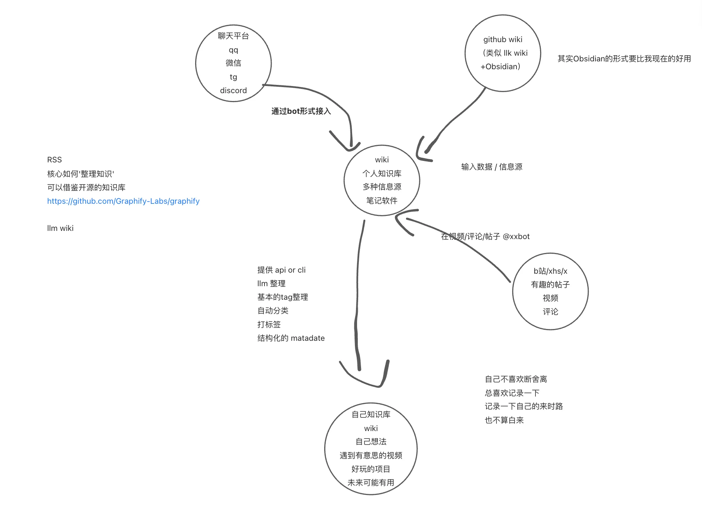

### 想法
想要的自己的，信息源中心，比如qq有意思的聊天记录，想法，自己整理的wiki，统一在一起
1. 有多种信息来源，统一整理，比如聊天平台，github的更新（特定的仓库，里面一般只有文档），语雀的更新，我想要的信息源的聚合，同时也可以自己添加，有结构化的matedata，表示这一条信息是什么，类似于大型的wiki，不过可以自己接入信息源，同时开放cli or api（让AI好管理），或者自定义信息源的接入类似于插件，
2. 同时也可以当作一个笔记软件，只不过接入了多种信息源
3. 如何整理信息？
   1. AI整理
   2. tag分类
说是知识库，差不多吧，类似于语雀，本质知识库
但是，我想要把不同渠道，不同信息源（微信，qq，xhs，微博，x，之类的，我看的的好玩的，有意思的）
（大家没有把一些代办，或者什么，发给自己吗)
中我觉得有用的信息整合一下
比如，qq聊天中一些有意思的图片，或者聊天记录
或者我github仓库里面的有用的文档，整合一下

大致的结构，想法图：